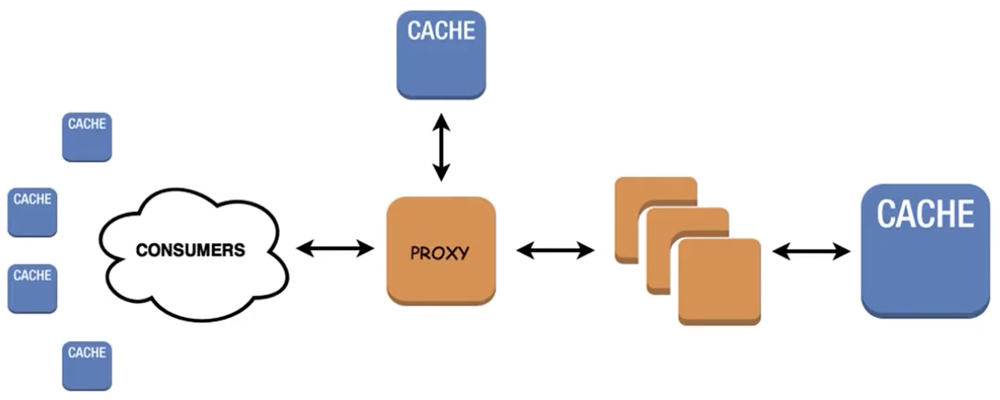

# Caching

## 🌱 A gentle intro
__Кэширование__ -- Один из самых простых и в то же время эффективных способов оптимизации веб-приложения. Данное решение удовлетворяет проектам любой сложности и является краеугольным камнем сервисов с большой нагрузкой. Идея оптимизации через кэш отнюдь не нова. Как вы знаете из CS101: 

!!! info "CS101"
    __любой алгоритм имеет пространственную и вычислительную сложности__. 

Не нужно далеко ходить за примером эффективного применения кэш-технологий; вы буквально смотрите на него прямо сейчас -- адресная строка браузера (ну, разве что чуть выше).   
Каждый раз когда вы указываете желаемый домен, например, `https://github.com`, вы не переходите волшебным образом на гитхаб. В данном случае _github -- это просто строка_. Чтобы попасть на какой-либо сервер необходимо знать его адрес. Для этого существуют __Domain Name Systems__. Строка с запросом отправляется через "удивительные миры интернета" к указанному в ваших настройках сети DNS-провайдеру. Зачастую это стандартный DNS вашего интернет-провайдера, но можно указать и любой другой, скажем, [Cloudflare 1.1.1.1](https://1.1.1.1/dns/).

!!! tip "забавный факт 🇷🇺"
    все запреты РКН модерируются только на стороне вашего провайдера, так что сменив DNS вы автоматически обходите все блокировки. 

Как только запрос попадает на ближайший DNS-сервер, запускается алгоритм поиска указанного домена в хэш-таблицах. Зачастую такой "лукап" занимает 10-50ms. Причем, чем популярнее сайт (чаще приходят запросы), тем быстрее происходит поиск. Это связано с несколькими уровнями кэширования. Подробнее об этой технологии вы можете прочитать [здесь [с картинами!]](https://www.cloudflare.com/ru-ru/learning/dns/what-is-dns/). А теперь перейдем непосредственно к решениям!

## 💾 Django caching

В Django существует встроенный интерфейс для кэширования которому лишь необходимо указать endpoint и backend. Так вы можете кэшировать результат работы представления, можете кэшировать только те куски, которые трудно вычислять или вовсе весь сайт.

Все рассмотренные ниже примеры являются базой данных, кэш-хранилищем и брокерами, что делает спектр их применения крайне обширным. Отличительная черта этих решений в том, что они хранят свои таблицы в оперативной памяти, что позволяет получать к ним доступ существенно быстрее нежели чем через традиционный запрос к БД, к которому можно еще добавить нагрузку от использования ORM-django (если вы его используете).

### 🔧 Setup

Для подключения кэширования в Django достаточно указать `CACHES` в настройках проекта. Однако, кэширование возможно не только с помощью специализированных утилит. Вы также можете хранить кэш в БД или файловой системе. В этом плане Django агностичен к вашему стеку. Таким образом, можно зарегестрировать несколько бэкендов хранилищей и указать множество путей до них, что позвоялет создать простую в дистрибуции оптимизацию для клиентов по всему миру. 

Пример настройки кэширования:
```python
CACHES = {
    'default': {  # Memcached backend
        'BACKEND': 'django.core.cache.backends.memcached.MemcachedCache',
        'LOCATION': [  # Multiple endpoints
            '172.19.26.240:11211',       # A direct IP endpoint
            'unix:/tmp/memcached.sock',  # A socket endpoint
        ]
    },
    'db': {  # DB caching
        'BACKEND': 'django.core.cache.backends.db.DatabaseCache',
        'LOCATION': 'my_cache_table',   # A table name
    },
    'fs': {  # File system caching
        'BACKEND': 'django.core.cache.backends.filebased.FileBasedCache',
        'LOCATION': '/var/tmp/django_cache',  # unix-like path | "c:/foo/bar" windows-like path
    }
}
```

!!! note "DatabaseCache"
    Чтобы задать эту настройку, необходим сначала создать соответствующую таблицу. Это можно сделать через `python manage.py createcachetable`


После настройки кэша необходимо указать [именно в таком порядке!]:
```python
# settings.py
MIDDLEWARE = [
    ...
    'django.middleware.cache.UpdateCacheMiddleware',
    'django.middleware.common.CommonMiddleware',
    'django.middleware.cache.FetchFromCacheMiddleware',
    ...
]
```

Это также позволяет съэекономить на цене обслуживания ваших инстансов, поскольку накладные расходы для кэша значительно меньше, вы значительно экономите на транзакциях к бд. Тем самым мы можем установить следующую топологию:



> redraw^^^^

Кэширование шаблонов.
```python
# settings.py

TEMPLATES = [
    {
        'BACKEND': 'django.template.backends.django.DjangoTemplates',
        'DIRS': [os.path.join(BASE_DIR, 'foo', 'bar'), ],
        'OPTIONS': {
            # ...
            'loaders': [
                ('django.template.loaders.cached.Loader', [
                    'django.template.loaders.filesystem.Loader',
                    'django.template.loaders.app_directories.Loader',
                ]),
            ],
        },
    },
]
```

Для кэширования сессий достаточно указать:
```python
# settings.py
SESSION_ENGINE = "django.contrib.sessions.backends.cache"
SESSION_CACHE_ALIAS = "default"
```
Далее, самая классная часть -- общий интерефейс кэширования. Как утверждалось ранее, Django полностью агностичен к технологии кэширования, главное чтобы был прописан бэкенд. Тем самым, мы можем лишь один раз написать обращения к кэшу, а потом изменять стек как нам угодно. Далее рассмотрим несколько примеров:     
Кэширование view:
```python
# views.py
from django.shortcuts import render
from django.views.decorators.cache import cache_page
from parrots import is_dead

@cache_page(60*10, cache='default', key_prefix='norwegian')  # 10 min cache
def blue_view(request):
    return render(request, 'pet_shop.html', {
        'parrot': is_dead()
    })
```

Тем самым запись в кэше будет выглядить так: `norwegian:views.decorators.cache.cache_page`

Обратите внимание на `key_prefix`. Он указывает на стандартый префикс ключа, который будет добавляться для каджого вхождения в наш кэш. Тем самым на одном Redis-сервере легко обслуживать сразу несколько кэшей. Этот параметр можно также указать и в `settings.py` для каждого бэкенда.

Кэширование urls:
```python
# urls.py
...
from django.views.decorators.cache import cache_page

urlpatterns = [
    path('page/<int:code>/', cache_page(60 * 15)(my_view)),
]
```

У кэширования также есть проблема связанная с [инвалидацией кэша](https://foshttpcache.readthedocs.io/en/latest/invalidation-introduction.html). Это как гонки-данных многопоточного программирования, только среди черепах и без сегфолтов. Основная проблема заключается в синхронизации всех компонентов кэширования для загрузки наиболее актуальных данных. По ссылке подробно написано о том, что это из себя представляет.

## 🍆 Reids
Чтобы установить 

Вы можете найти инструкцию по установке [здесь](https://redis.io/download).   
Далее необходимо запустить инстанс Redis. Для этого можем создать две сесии терминала и в одной из них написать:
```
redis-server
``` 

!!! tip "protip"
    Конечно, крутые ребята сразу все деплоят и демонизируют процессы, но оставим это на самостоятельное изучение.
Как только вы запустили сервер, вернувшись в другое окно терминала, можете проверить ее работоспособность вызвав:
```shell
redis-cli
```
Если все прошло 🍓🍓🍓клубнично🍓🍓🍓, вы увидите приглашение к вводу от Redis. Далее мы можем создать первую запись:
```shell
redis> set me_some beer
OK
redis> get me_some
"beer"
```
Ура, вы только что записали что-то в Redis. 

Альтернативно, быстрее проверить связь с сервером через `ping`:
```shell
redis-cli ping
PONG
```

Конечно существуют еще и другие команды, но нам это не понадобится, так как за нас все сделает интерфейс кэширования Django.

чтобы установить его достаточно ввести следующее:
```shell
pip install django-redis
```

!!! tip "django-redis"
    Функционал этого пакета довольно обширный, и [рекомендуется к ознакомлению](https://github.com/jazzband/django-redis) для продвинутого использования.

Далее мы можем указать в настройках наш кэш:
```python
CACHES = {
    "default": {
        "BACKEND": "django_redis.cache.RedisCache",
        "LOCATION": "redis://127.0.0.1:6379/1",
        "OPTIONS": {
            "CLIENT_CLASS": "django_redis.client.DefaultClient"
        },
    }
}
```


Теперь мы можем обратиться к нашему кэшу:
```python
>>>from django.core.cache import cache
>>>cache.set("foo", "bar", timeout=25)
>>>cache.get("foo")
"bar"
>>>cache.ttl("foo")
25
```

!!! note "cache"
    Повторим, что подобное обращение не характерно исключительно для Redis, это лишь "низкоуровненвый" интерфейс Django для работы с кэшем.


## ⚡️ Memcached

Самый быстрый и эффективный тип кэша, доступный Django, Memcached является кэшем, который полностью располагается в оперативной памяти; изанчально он был разработан для LiveJournal.com и позднее переведён в open-source компанией Danga Interactive. Он используется такими сайтами как Facebook и Wikipedia для снижения нагрузки на базу данных и значительного увеличения производительности сайта.

Memcached работает как демон и захватывает определённый объём оперативной памяти. Его задачей является представление быстрого интерфейса для добавления, получения и удаления определённых данных в кэше. Все данные хранятся прямо в оперативной памяти, таким образом нет никакой дополнительной нагрузки на базу данных или файловую систему.


```
pip install python-memcached
```

