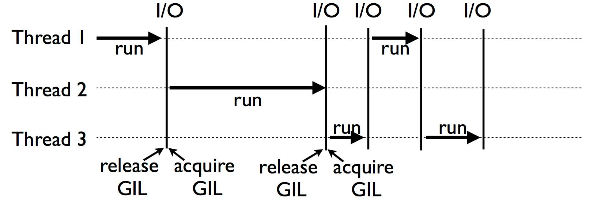
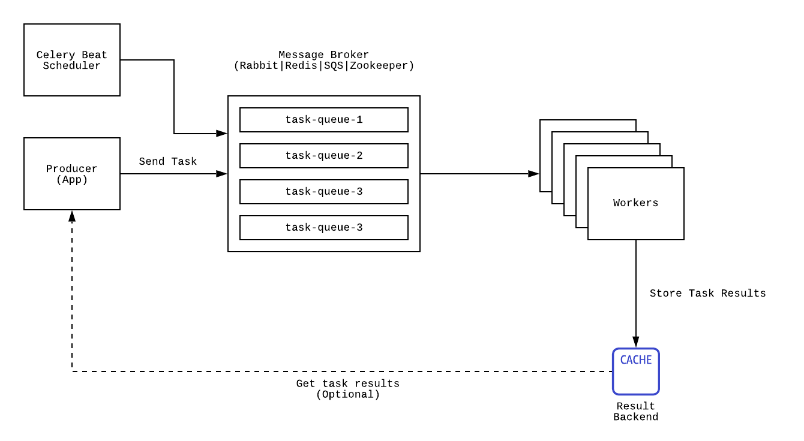

## 🧮 CPU
В этой главе мы рассмотрим механизмы оптимизации __вычислений__ на сервере.    
Скажем, у нас есть функция `f(**kwargs) -> int`, которая чисто случайно оказывается функцией [BusyBeaver](https://en.wikipedia.org/wiki/Busy_beaver): 
```python
# views.py
...

@api_view(['POST'])  # Some DRF magic
def bb_view(request: json):
    iterations = busy_beaver(**request.get('states'))
    logging.info(f"HALTED AFTER: {iterations}")
```
Как вы понимаете, в зависимости от указанных параметров в `states`, запрос к данному view может выполняться _очень долго_; и браузер выкинет таймаут. Что хуже, если все пользователи решат воспользоваться великолепной фичей вашего сайта, все воркеры обслуживающие клиентов также залипнут в ожидании завершения функции, что сделает любой запрос на наш сайт __необслуживаемым__. Хуже данной ситуации уже не может быть, поэтому давайте рассмотрим механизмы того как это можно исправить.    
Ну конечно же можно делегировать выполнение задач в дочерние потоки или процессы!

## 🎢 Multiprocessing|Threading|Async

### 🧵 Threading

В Python дела с потоками обстоят не так просто. Виной всему является злощастный __GIL__ [**G**lobal **I**nterpreter **L**ock]. Он позволяет лишь **одному** потоку исполнять байткод. Это сделано из соображений простоты реализации интерпретатора и потокобезопасности. Многие, обычно сторонние от Python-сообщества программисты, слыша GIL начинают орать как гиены, что это замедляет Python, это жутко не удобно и т.п. Хотя, стоит отметить, что некоторых реализациях языка его попросту нет.   
На самом деле, если понимать устройство лока, то можно использовать его по полной. 
Трепищите, это __GIL__ в референсной интепретации __CPython__:
```C
static PyThread_type_lock interpreter_lock = 0; /* This is the GIL */
```
Да, это просто булевая переменная в терминах языка `C`. Сама спецификация языка указывает на еще 2 дополнительные перменные для менеджмента состояния `gil_mutex` и `gil_cond` с кучей макросов для их логики. Вы можете [посмотреть сюда](https://github.com/python/cpython/blob/master/Python/ceval_gil.h) чтобы прочитать исходный код GIL'а.     
Для исполнения каждого потока мы должны сделать `acquire_gil`, а исполняемый до этого поток должен сделать `release_gil`. Такой процесс происходит каждый раз когда мы исполняемся заданное количество времени или происходит блокирующий вызов.

Чтобы создать поток достаточно импортировать библиотеку `threading`. Давайте улучшим пример из Introduction.

```python linenums="1"
from typing import List
from threading import Thread
import requests

def send_request(url: str, result: List[str]) -> bytes:
  result.append(requests.get(url).content)  # disgusting write from within a thread

def manage_requests(targets_file: str) -> List[bytes]:
  reponses: List[str] = []
  thread_pool: List[Thread] = []  # create a thread pool
  with open(targets, "r") as f:
    for url in f:
        thread_pool.append(Thread(target=send_request, args=(url, reponses,))) # spawn a thread
        thread_pool[-1].start()  # start it
        responses.append(send_request(url))
  [thread.join for thread in thread_pool]  # join threads and await results
  return responses

if __name__ == '__main__':
  results = manage_requests("my_req_urls")
  ... # Process results
```

### 📈 concurent.futures

Цитируя умных людей

!!! quote "Raymond Hettinger"
    There's got to be a better way to do this!

Конечно стандартная библиотека Python растет и теперь у нас есть более приятный интерфейс для решения подобных задач: `concurent.futures`. Этот модуль является высокоуровневым интерфейсом для асинхронного исполнения функций.

```python linenums="1"
from typing import List
from сoncurent import futures
import requests

def send_request(url: str) -> bytes:
  return requests.get(url).content  # now that's much better

def manage_requests(targets_file: str) -> List[bytes]:
  reponses: List[str] = []
  thread_pool: List[Thread] = []  # create a thread pool
  with open(targets, "r") as f:
    with concurrent.futures.ThreadPoolExecutor(max_workers=5) as executor:
    # Start the load operations and mark each future with its URL
    future_to_url = {executor.submit(send_request, url, 60): url for url in f}
    for future in concurrent.futures.as_completed(future_to_url):
        url = future_to_url[future]
        try:
            data = future.result()
        except Exception as e:
            print(f"{url} generated an exception: {e}")
        else:
            print(f"{url} page is {len(data)} bytes")
  return responses


if __name__ == '__main__':
  results = manage_requests("my_req_urls")
  ... # Process results
```

Но знаете что?

!!! quote "Raymond Hettinger"
    There's got to be a better way to do this!

Если вы отматаете на два примера вверх, то увидите, важную фразу, что смена исполнительного потока **происходит при блокирующем вызове**. Значит при каждом обращении к IO мы можем делигировать питону задачи, пока он будет ожидать ответа. Эта идея фундаментальна для осознания концепции асинхронных функций и конкурентного исполнения кода. 

То о чем я пишу можно изобразить следующим образом:



### 📞 Async

Начиная с Python 3.5 в языке появились ключевые слова `async`/`await`, которые позволяют пользователю задавать в удобной форме воркфлоу. 

```python linenums=1
import aiohttp
import asyncio

async def send_request(url: str) -> bytes:
    return await requests.get(url).content

async def manage_requests(targets_file: str) -> List[bytes]:
    tasks = []
    with open(target_file, "r") as f:
        for url in f:
            tasks.append(send_request(url))
        responses = await asyncio.gather(*tasks)
    return responses

if __name__ == '__main__':
    loop = asyncio.get_event_loop()  # We need to create an event_loop
    loop.run_until_complete(manage_requests())
```

Данный метод при каждом _await_ будет менять активный поток и делать следующую итерацию в цикле `event_loop`. Однако `requests` библиотека в терминах асинхронной парадигмы является __блокирующей__. Дело в том, что для максимально оптимального использования вызовов и жанглирования потоками, ваш код не должен содержать обыкновенных блокирующих вызовов, иначе, встретив такой вызов, поток просто встанет и будет ожидать завершения. Поэтому когда вы используете какие-либо библиотеки с AsyncIO, обязательно убедитесь, что она также поддерживает `async`/`await`.    
Ну а теперь: 

!!! quote "Raymond Hettinger"
    There's got to be a better way to do this!

### 🕸 aiohttp

Одним из примеров неблокирующей библиотеки для работы с веб-запросами является aiohttp. Она обеспечит оптимальное исполнение кода в "неблокирующем" формате:

Сначала
```shell
pip install aiohttp
```

И затем

```python linenums="1"
from typing import List
import aiohttp
import asyncio

async def fetch(session, url):
    async with session.get(url) as response:
        return await response.text()

async def manage_requests(targets_file: str) -> List[bytes]:
    with open(targets_file, "r") as f:
        async with aiohttp.ClientSession() as session:
            tasks = [tasks.append(fetch(session, url) for url in f]
            return await asyncio.gather(*tasks)
        

if __name__ == '__main__':
    loop = asyncio.get_event_loop()
    loop.run_until_complete(manage_requests())
```
Гораздо лучше. Однако мы по прежнему не можем действительно параллельно выполнять несколько инструкций. Для того чтобы обойти это ограничение был сделан `multiprocessing`

### ∥ Multiprocessing

Благодаря GIL, для достижения действительно параллельного кода, в Python используются процессы. Сразу же о плохом: значительные накладные росходы по сравнению с потоками, нет разделенной памяти между процессами. На сегодняшний день ведутся разработки по созданию суб-интерпретаторов для достижения параллельности с меньшими расходами, но это все еще в ранней стадии. Хотя в CPython уже есть API.

Давайте попробуем убрать блокировку нашего view из начала глава:

```python linenums="1"
# views.py
...
from multiprocessing import Process

@api_view(['POST'])  # Some DRF magic
def bb_view(request: json):
    iterations = Process(target = busy_beaver, args=(**request.get('states')))
    logging.info(f"HALTED AFTER: {iterations}")
```

Также есть удобный `Pool` интерфейс для создания множества процессов за раз. Например: 
```python linenums="1"
from multiprocessing import Pool

def f(x: int) -> int:
    return x*x

if __name__ == '__main__':
    with Pool(5) as p:
        print(p.map(f, [1, 2, 3]))
```

Теперь наша задача будет считаться в абсолютно параллельном процессе. Однако стоит постоянно держать в голове, что потоки и процессы также несут накладные расходы на их создание, передачу результатов и т.п. Поэтому не стоит пытаться распараллелить абсолютно каждую задачу.

## 💪 Celery

Конечно же, для параллельного вычисления есть решения и лучше! Если мы обслуживаем множество различных сложных запросов, то нам просто необходима централизованная система для мониторинга их исполнения и выстраивания очередей в соответствии с нагрузкой. Такой функционал предоставляет `Celery`.

Celery позволяет задать очень гибкую настройку под любую нагрузку! Архитектура выглядит следующим образом:



Приложение, при запросе, создает соответствующую задачу, которая отправляется в брокер, который постоянно читают `celery` воркеры. Как только находится сообщение с задачей в очереди, воркер начинает его исполнение, и при необходимости сохраняет результат, который приложение может получить уже через API результатов в `celery`.
В верхем-левом углу указан Scheduler, который занимается исполнением cron-like задач. Т.е. мы можем задать некоторую периодическую задачу, например, очистить бд каждый день в 3 часа ночи или каждую минуту отправить пинг стороннему сервису. Все это очень легко сделать с `Celery`, но сначала установка:

`pip install Celery`

либо можно подтянуть сразу зависимости к выбранному стеку:

`pip install "celery[librabbitmq,redis,auth,msgpack]"`

!!! note "Celery"
    Я настоятельно рекомендую ознакомиться с официальной документацией, поскольку Celery умеет так много, что по нему нужно писать отдельную методичку. [Подробнее тут](https://docs.celeryproject.org/en/stable/index.html)

Для настройки создадим файл `celery.py` в корне `proj`, где лежит `settings.py`.
```python linenums="1"
# celery.py
import os
from celery import Celery

# set the default Django settings module for the 'celery' program.
os.environ.setdefault('DJANGO_SETTINGS_MODULE', 'proj.settings')

app = Celery('proj')

# Using a string here means the worker doesn't have to serialize
# the configuration object to child processes.
# - namespace='CELERY' means all celery-related configuration keys
#   should have a `CELERY_` prefix.
app.config_from_object('django.conf:settings', namespace='CELERY')

# Load task modules from all registered Django app configs.
app.autodiscover_tasks()
```

Добавим это в `__init__.py` для того, чтобы клиент `celery` мог увидеть наши веб-приложения:
```python
# This will make sure the app is always imported when
# Django starts so that shared_task will use this app.
from .celery import app as celery_app

__all__ = ('celery_app',)
```

Теперь внутри приложений можно задать отдельные задачи в `tasks.py`
```
- app1/
    - tasks.py
    - models.py
- app2/
    - tasks.py
    - models.py
```

Определим задачу из начала главы для `Celery`:
```py
from typing import Dict
from my.proj import celery_app

@celery_app.task(name="bb_task")
def busy_beaver(instructions: Dict):
    ...# bb code
```

Отлично, теперь мы можем просто воспользоваться интерфейсом запуска задач на воркере -- `delay`. По своей сути это такой `apply_async`. [Здесь](https://docs.celeryproject.org/en/stable/userguide/calling.html) подробнее об этом написано.
```py
# views.py
...

@api_view(['POST'])  # Some DRF magic
def bb_view(request: json):
    busy_beaver.delay(**request.get('states'))  # start the task
    # logging.info(f"HALTED AFTER: {iterations}")
```
### Results
Однако, мы не сможем увидеть результат(((
Для доступа к резльтатом необходимо дополнительно установить расширение 
`pip install django-celery-results`
и добавить 
```py
# settings.py
INSTALLED_APPS = (
    ...,
    'django_celery_results',
)
```
затем создать таблицу `python manage.py migrate django_celery_results`.    
Далее необходимо указать бэкенд для наших результатов, и здесь мы можем использовать старый-добрый кэш.
```py
# celery setting.
CELERY_CACHE_BACKEND = 'default'

# django setting.
CACHES = {
    'default': {
        ...
    }
}
```


### Scheduler
Этот пакет позволяет устанавливать расписание для задач. Для установки выполните `pip install django-celery-beat`.    
Затем зарегестрируйте приложение в Django:
```py
# settings.py
INSTALLED_APPS = (
    ...,
    'django_celery_beat',
)
```

И наконец сделайте миграцию бд `python manage.py migrate`

Один из способов регистрации расписания -- указание в конфиге `Celery` приложения:
```py
instructions = {...}
app.conf.beat_schedule = {
    'bb-every-30-seconds': {
        'task': 'proj.tasks.bb_task', # path to the function through the module tree
        'schedule': 30.0,
        'args': (**instructions)
    },
}
app.conf.timezone = 'UTC'
```
Об альтернативных способах запуска -- [подробнее тут](https://docs.celeryproject.org/en/stable/userguide/periodic-tasks.html#beat-custom-schedulers)

### Boot
Наконец, чтобы запустить воркер Celery, достаточно написать в терминале: `celery -A proj worker -l INFO`. `-b` Добавит к воркерам scheduler, который сможет мониторить расписание задач.